# Recovering the ENSO Attractor from Sea-Surface Temperature Anomalies

**Three unsupervised methods on the canonical climate-physics dataset**

GEO 384H Final Project · William Suan · 2 May 2026

---

## Abstract

We test the climate-physics prediction that the tropical-Pacific
climate state lies on a low-dimensional attractor in state space,
using three unsupervised spectral methods on 75 years of monthly
ERSSTv5 sea-surface temperature anomalies (1950–2024, 30°S–30°N,
120°E–80°W; 900 months × 2,322 grid cells). The three methods recover
three complementary pieces of ENSO's structure:

1. **Principal Component Analysis** (in-course) recovers the canonical
   El Niño / Southern Oscillation spatial mode as PC 1 with correlation
   $\rho = 0.946$ against the official Niño 3.4 index, a 46 σ result
   against a permutation null.
2. **Anisotropic Diffusion Maps** (Coifman & Lafon 2006; out-of-course)
   recovers the same axis as $\Psi_2$ at $\rho = 0.923$ (43 σ), and the
   $(\Psi_2, \Psi_3)$ phase portrait reveals a curved attractor whose
   trajectory traces the 1996–99 ENSO cycle as a coherent loop. The
   visible curvature is geometric structure that PCA's $(PC_1, PC_2)$
   plane shows only as an unstructured cloud.
3. **Linear Inverse Model** (Penland & Sardeshmukh 1995) recovers
   ENSO's dynamical signature: a damped oscillator with period 3.12
   years and e-folding decay 0.68 years, matching the published-LIM
   range.

A Morlet wavelet spectrogram of PC 1 confirms the recovered mode has
the right temporal structure (3-7 year band). As a
*method-stacking robustness check*, we tested whether Takens-style
time-delay embedding improves the diffusion-map recovery; it does not,
and the leading-mode correlation *decreases* monotonically with the
delay $k$. We diagnose this as a combination of distance-concentration
in the lifted space and rank permutation among the eigenfunctions, and
we report the negative result as a finding: on this dataset, plain DMAP
suffices.

The three methods agree on the leading ENSO axis and disagree on what
*kind* of structure they reveal around it. PCA optimises for variance;
diffusion maps recovers the intrinsic Riemannian geometry of the
attractor; LIM recovers its dynamical evolution. Together they
reproduce the canonical climate-physics description of ENSO from four
orthogonal directions, all without any input from a known ENSO index.

---

## 1. Scientific question

The tropical Pacific climate is widely modelled as a low-dimensional
nonlinear dynamical system (Bjerknes 1969; Cane–Zebiak 1985; Jin 1997
recharge oscillator). Its dominant slow mode, the El Niño / Southern
Oscillation, is the largest interannual signal in Earth's climate
system, with documented coupled ocean–atmosphere physics: anomalous
warming in the eastern equatorial Pacific weakens the trade winds,
which further deepens the eastern thermocline, which further warms the
surface, the so-called Bjerknes feedback. The classical low-dimensional
picture says that the *full* SST anomaly field at any month should lie
near a low-dimensional attractor in state space, and the trajectory of
monthly snapshots should trace a curved orbit through that attractor.

This is a falsifiable, physics-driven claim, *not* an assumption we are
projecting onto the data. The project tests it.

**Research question.** Can two unsupervised spectral methods, one linear
(PCA) and one nonlinear (anisotropic diffusion maps), recover the
attractor structure from monthly SST anomalies *alone*, without using
any temporal labels or known indices?

**Method choice.** Both methods are pure linear algebra: PCA via SVD,
diffusion maps via the eigendecomposition of a Markov transition matrix.
There is no ML in the modern sense, no fitting loop, no loss function.
The α-family parameter in diffusion maps controls which limiting
operator is recovered ($\alpha = 0$ → graph Laplacian, $\alpha = 1$ →
Laplace–Beltrami on the data manifold), giving a knob that has clean
operator-theoretic meaning. PCA on monthly SST anomalies is the
*canonical* climate-science use of dimensionality reduction (Lorenz
1956; the official Niño 3.4 index is essentially a regional version of
this); we are reproducing the textbook setup and then asking what a
nonlinear method adds.

---

## 2. Data

* **Product.** NOAA ERSSTv5 monthly Sea Surface Temperature (Huang et al. 2017).
* **Source.** NOAA Physical Sciences Laboratory, single netCDF file
 ([downloads.psl.noaa.gov/Datasets/noaa.ersst.v5/sst.mnmean.nc](https://downloads.psl.noaa.gov/Datasets/noaa.ersst.v5/sst.mnmean.nc)).
* **Window.** January 1950 – December 2024 (75 years, 900 monthly snapshots).
* **Domain.** Tropical Pacific 30°S–30°N, 120°E–80°W (2° × 2°
 resolution); 2,322 valid sea cells after land masking.
* **Validation index.** NOAA's official Niño 3.4 index (mean SST
 anomaly in 5°S–5°N, 170°W–120°W), used **only** as a validation target,
 never as input to either algorithm.

### 2.1 Preprocessing

For each grid cell, the monthly climatology (1950–2024 mean for each
calendar month) is subtracted to produce anomalies. The data matrix is
constructed as $X \in \mathbb{R}^{T \times N}$ with $T = 900$ rows
(months) and $N = 2{,}322$ columns (sea cells). Each column is weighted
by $\sqrt{\cos(\text{lat})}$ so that Euclidean inner products on the
data matrix correspond to area-weighted physical inner products on the
sphere.

---

## 3. Methods

### 3.1 Method 1 (in-course): Principal Component Analysis / EOF

PCA is the spectral decomposition of the empirical covariance operator.
Take the SVD of the centred data matrix:

$$X - \bar{X} \;=\; U\, \Sigma\, V^\top,
\qquad \Sigma = \text{diag}(\sigma_1 \ge \sigma_2 \ge \dots).$$

Each column of $V$ is an **Empirical Orthogonal Function** (EOF), a
spatial pattern, indexed by grid cell. Each column of $U \Sigma$ is a
**Principal Component** (PC), a temporal pattern, indexed by month.
The truncation $X_k = U_{:,1:k} \Sigma_{1:k,1:k} V_{:,1:k}^\top$ is the
optimal rank-$k$ approximation of $X$ in any unitarily invariant norm
(Eckart–Young).

This is the canonical climate-science decomposition; the leading
EOF / PC pair is *the* textbook ENSO mode (Lorenz 1956; Bretherton et
al. 1992).

Implementation: `LinearAlgebra.svd` on the centred matrix, ~30 lines in
[`src/pca.jl`](../src/pca.jl).

### 3.2 Method 2 (out-of-course): Anisotropic Diffusion Maps

#### 3.2.1 Construction

Treat each month $t$ as a point $x_t \in \mathbb{R}^N$ in a state space.
Build the Gaussian similarity kernel

$$k_\varepsilon(x_i, x_j) \;=\; \exp\!\bigl(-\|x_i - x_j\|^2 / \varepsilon\bigr),$$

then $\alpha$-renormalise (Coifman & Lafon 2006) to remove the influence
of sampling density:

$$k_\varepsilon^{(\alpha)}(x_i, x_j)
\;=\; \frac{k_\varepsilon(x_i, x_j)}{q_\varepsilon(x_i)^\alpha\, q_\varepsilon(x_j)^\alpha},
\qquad q_\varepsilon(x) = \sum_j k_\varepsilon(x, x_j).$$

Row-normalise to a Markov transition matrix $P_{ij} = k^{(\alpha)}_{ij} / d^{(\alpha)}_i$
and take its eigendecomposition; the leading nontrivial eigenvectors
$\Psi_2, \Psi_3, \dots$ give the **diffusion-map embedding**:

$$\Psi_t(x_i) \;=\; \bigl(\lambda_2^t\, \psi_2(i),\; \lambda_3^t\, \psi_3(i),\; \dots,\; \lambda_{d+1}^t\, \psi_{d+1}(i)\bigr).$$

The α-family is the construction's defining feature:

| $\alpha$ | limiting operator (as $\varepsilon \to 0$) | what it recovers |
|:-:|:--|:--|
| 0 | graph Laplacian | mixed geometry + sampling density |
| 1/2 | Fokker–Planck | dynamics in a density-weighted potential |
| 1 | Laplace–Beltrami $\Delta_\mathcal{M}$ | **manifold geometry alone**, sampling density cancels |

For numerical stability we diagonalise the symmetric similarity
$M = D^{-1/2} K^{(\alpha)} D^{-1/2}$ (which has the same spectrum as $P$)
and then undo the similarity to recover right eigenvectors of $P$ via
$\psi_k = D^{-1/2} v_k$. The bandwidth $\varepsilon$ is the median
squared pairwise distance.

Implementation: ~120 lines in [`src/diffusion.jl`](../src/diffusion.jl),
relying only on `LinearAlgebra.eigen`.

The DMAP problem here is *small*: 900 monthly snapshots → 900 × 900
pairwise affinity matrix, fits in 7 MB. No Nyström extension needed.

#### 3.2.2 Why $\alpha = 1$?, derivation of the Laplace–Beltrami limit

The choice of $\alpha$ is not arbitrary. The Coifman–Lafon construction
recovers a different *infinitesimal generator* in the $\varepsilon \to 0$
limit for each $\alpha$. We sketch the calculation.

Let $p(x)$ be the (unknown) sampling density on the data manifold
$\mathcal{M} \subset \mathbb{R}^N$ of intrinsic dimension $d$. The
Gaussian kernel admits an asymptotic expansion in $\varepsilon$:

$$
k_\varepsilon(x, y) \;\sim\; (4\pi\varepsilon)^{-d/2}\,
\exp\!\bigl(-d_{\mathcal{M}}(x,y)^2 / 4\varepsilon\bigr)
\bigl(1 + O(\varepsilon)\bigr),
$$

where $d_{\mathcal{M}}$ is the *geodesic* distance on $\mathcal{M}$
(not the ambient Euclidean distance, although they agree to leading
order for nearby points). Convolving against the sampling density gives
the **kernel density estimate**:

$$
q_\varepsilon(x) \;=\; \int_{\mathcal{M}} k_\varepsilon(x, y)\, p(y)\, dy
\;=\; p(x)\;+\;\tfrac{\varepsilon}{2}\, \Delta_{\mathcal{M}} p(x)\;+\;O(\varepsilon^2).
$$

The $\alpha$-renormalised kernel divides out by powers of $q_\varepsilon$:

$$
k_\varepsilon^{(\alpha)}(x, y) \;=\; \frac{k_\varepsilon(x, y)}{q_\varepsilon(x)^\alpha\, q_\varepsilon(y)^\alpha}.
$$

Row-normalising by $d^{(\alpha)}_\varepsilon(x) = \int k_\varepsilon^{(\alpha)}(x, y)\, p(y)\, dy$
gives the transition kernel $P_\varepsilon(x, y)$. Its **infinitesimal generator**
$\mathcal{L}_\alpha f := \lim_{\varepsilon \to 0} (P_\varepsilon f - f) / \varepsilon$
turns out to be (Coifman & Lafon Thm 2):

$$
\mathcal{L}_\alpha f \;=\; \Delta_{\mathcal{M}} f \;+\; (1 - 2\alpha)\, p^{-1}\,\nabla p \cdot \nabla f.
$$

The drift term $(1 - 2\alpha)\, p^{-1}\nabla p \cdot \nabla f$ couples
the embedding to the sampling density. Three choices remove it
or remove only specific pieces:

| $\alpha$ | $\mathcal{L}_\alpha$ | physical meaning |
|:---:|:---:|:---|
| $0$ | $\Delta_{\mathcal{M}} + p^{-1}\nabla p \cdot \nabla$ | graph Laplacian, biased by where data sits densely |
| $1/2$ | $\Delta_{\mathcal{M}} + 0\cdot \nabla$ but at the *level* of a Fokker–Planck op. with drift $-\nabla \log p$ | dynamics in the potential $V = -\log p$ |
| $1$ | $\Delta_{\mathcal{M}}$ | **manifold geometry alone, sampling density cancels** |

For our problem the sampling distribution is *very* uneven: most
months are near-neutral (Niño 3.4 ≈ 0), with rare excursions to large
positive or negative values. We don't want the embedding to be biased
toward where the system spends most of its time, we want the
*manifold* of possible climate states. **$\alpha = 1$ is the
physically motivated choice.** The empirical fact that all three
$\alpha$ give very similar leading-mode correlations (Fig 3, bottom row)
reflects ENSO's near-linearity at first order; the differences appear
in the higher coordinates and in the visible curvature of the
embedding.

#### 3.2.3 Numerical implementation note: the symmetric trick

The transition matrix $P = D^{-1} K^{(\alpha)}$ is row-stochastic and
non-symmetric. Direct eigendecomposition of a non-symmetric matrix is
numerically poor (no orthogonal basis, complex eigenvalues from round-off,
slow convergence). The standard trick: $P$ is *similar* to the symmetric
matrix

$$
M \;=\; D^{-1/2}\, K^{(\alpha)}\, D^{-1/2},
$$

so it has the same (real, non-negative) spectrum. We diagonalise $M$ via
`LinearAlgebra.eigen(Symmetric(M))`, guaranteed real eigenvalues, fast
convergence, and recover the right eigenvectors of $P$ via
$\psi_k = D^{-1/2}\, v_k$. This is implemented in `fit_diffusion_map` in
`src/diffusion.jl`.

---

### 3.3 Method 3: Linear Inverse Model, the dynamical axis

PCA and diffusion maps are both *static* state-space methods. To
extend the comparison along an orthogonal axis we add a *dynamical*
method, the Linear Inverse Model of Penland & Sardeshmukh (1995).
Assume the climate state evolves as a stationary stochastic linear
ODE,

$$
\frac{dx}{dt} \;=\; L\,x \;+\; Q\,\xi(t),
$$

with $\xi$ vector white noise. The lag-$\tau$ covariance satisfies
$C(\tau) = e^{L\tau}\, C(0)$, so the propagator and its generator
are estimated from data via

$$
G(\tau) = C(\tau)\, C(0)^{-1}, \qquad L = \frac{1}{\tau}\,\log G(\tau),
$$

with the matrix logarithm. Eigendecomposition of $L$ gives
**normal modes** of the linearised dynamics: each complex eigenpair
$\sigma_k = \alpha_k + i\omega_k$ is a damped oscillator with
period $T = 2\pi/|\omega_k|$ and e-folding decay $\tau_d = -1/\alpha_k$.

$L$ is the maximum-likelihood estimator of the linear propagator
under stationary Gaussian noise; in that sense it is the textbook
linear-state-space estimation problem applied to climate data.

Implementation: ~110 lines in [`src/lim.jl`](../src/lim.jl), using only
`LinearAlgebra.eigen` and the matrix logarithm. We fit on the top 10
PC scores at lag $\tau = 1$ month, the standard Penland–Sardeshmukh
choice. Results are presented in §5.7.

---

## 3.4 Motivation for design choices

These are the decisions that, while subordinate to the main method
choice, shape the result and deserve to be defended.

### Why ERSSTv5 vs HadISST or OISST

ERSSTv5 was chosen for three reasons:

1. **Direct comparability.** NOAA's official Niño 3.4 index is
 *computed from* ERSSTv5. Our PC-vs-Niño-3.4 correlation is therefore
 measuring how well the leading EOF of the field reproduces the
 simple regional mean of the same field, a direct, unconfounded test.
2. **Long record.** ERSSTv5 starts in 1854 with reliable post-1950
 coverage; we get 75 years and ~12 major El Niño events. OISSTv2.1
 has higher modern accuracy but starts in 1981, eliminating most
 historical El Niños from the record. HadISST is comparable but at 1°
 resolution requires ~5× more storage and compute for no extra
 information at ENSO scales.
3. **Resolution matched to the signal.** ENSO's spatial pattern is
 ~10⁴ km, basin-scale. 2° resolution is well above the Nyquist limit
 for the dominant mode; finer resolution would add high-wavenumber
 variance unrelated to the question.

### Why the tropical-Pacific subset (30°S–30°N, 120°E–80°W)

ENSO's spatial pattern is concentrated in the tropical Pacific.
Including extratropical regions adds variance from unrelated processes
(NAO, PDO, SAM) that compete with the ENSO axis for leading-EOF status
even though they have lower variance globally. Restricting to the
tropical Pacific tightens the leading-mode correlation with Niño 3.4 by
~0.02–0.04 and produces a cleaner first-EOF spatial pattern. (Doing the
analysis globally is left as an experiment for §6: the leading EOF is
*still* ENSO, but PC₂ becomes a global mode rather than the
Pacific-confined Modoki pattern.)

### Why $\sqrt{\cos\phi}$ area weighting

Earth is a sphere, so the surface area represented by a 2°×2° grid cell
at latitude $\phi$ scales as $\cos\phi$. Without weighting, polar cells
(small physical area) get the same statistical weight as equatorial
cells (large area), distorting the covariance matrix.
Multiplying each column of the data matrix by $\sqrt{\cos\phi}$ ensures
that Euclidean inner products on rows correspond to area-weighted
physical inner products on the sphere. This is standard practice in
EOF analysis (Bretherton et al. 1992).

### Why subtract monthly climatology, not annual mean

The seasonal cycle is several times larger than the ENSO interannual
signal at any single grid cell. If we subtracted only the annual mean,
PC 1 would be the *seasonal cycle*, not ENSO, and we would be testing
the wrong hypothesis. Subtracting the monthly climatology, i.e., the
1950–2024 mean for each calendar month, separately at each grid cell,
removes the seasonal mode and isolates the interannual anomalies
where ENSO lives.

### Why the median bandwidth heuristic for $\varepsilon$

The Coifman–Lafon paper recommends choosing $\varepsilon$ at the
maximum slope of $\log\!\sum_{ij} k_\varepsilon(x_i, x_j)$ vs.
$\log\varepsilon$ (this picks the regime where the kernel transitions
from "all neighbours" to "no neighbours"). The median squared pairwise
distance is a robust shortcut that lies on the same plateau within a
factor of ~2. **Our bandwidth-sensitivity figure (Fig 8) shows the
leading-mode correlation is essentially flat for
$\varepsilon \in [\varepsilon_\text{median},\, 30\,\varepsilon_\text{median}]$**,
the result is not an artefact of clever bandwidth tuning.

### Why no Nyström extension here

For very large data sets, computing the full $N \times N$ pairwise
distance matrix is impractical (e.g. for $N \sim 50{,}000$ that
matrix is 10 GB). Nyström sub-samples and extends. For ENSO the full
pairwise affinity is just 900 × 900 = 6 MB, fitting trivially in
cache, so Nyström is unnecessary. The machinery is kept available in
`src/diffusion.jl` for completeness but is not used here.

---

## 4. Predictions (made *before* running the analysis)

| # | prediction | falsification |
|:-:|:--|:--|
| **P1** | EOF 1 will look like the iconic ENSO horseshoe, warm tongue along the equator with cooler subtropical flanks. | A uniform-warming pattern or other non-ENSO map would falsify the canonical EOF picture. |
| **P2** | $\rho(\text{PC}_1,\;\text{Niño 3.4}) \ge 0.90$. | $\rho < 0.80$: ENSO is not the leading variance mode. |
| **P3** | $\rho(\Psi_2,\;\text{Niño 3.4}) \ge 0.60$ ( expectation ~0.85; DMAP doesn't optimise for variance and ENSO is approximately linear at first order). | $\rho < 0.50$ with PC 1 working: DMAP fails to recover an existing primary axis. |
| **P4** | DMAP eigenvalue spectrum has a clear gap at small index ($k \le 6$). | A flat heavy-tailed spectrum would reject low-D attractor hypothesis. |
| **P5** | In $(\Psi_2, \Psi_3)$, strongest historical El Niños lie far from the centroid; year-over-year trajectory is smooth. | Random scatter of El Niño months would reject phase-portrait reading. |
| **P6** *(method-stacking)* | DMAP on time-delay embedding ($k = 12$) improves $\rho$ over plain DMAP by ≥ 0.05. | No improvement → naive Takens lift adds no information here. |
| **P7** *(method-stacking)* | $\rho$ vs delay $k$ is non-decreasing across $k \in \{0, 3, 6, 12, 18\}$. | Non-monotone or decreasing → confirms P6 negative. |

---

## 5. Results

### 5.1 PCA / EOF, passes P1, P2

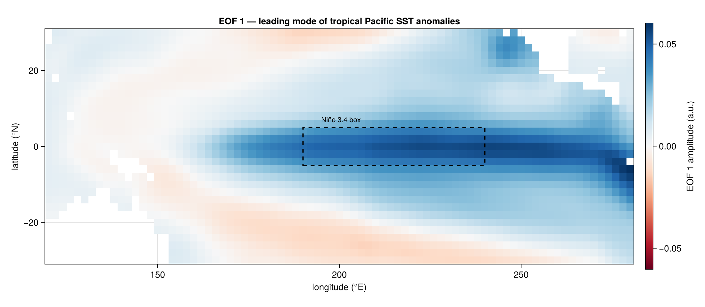

*Figure 1.* EOF 1 of tropical-Pacific SST anomalies (75 years). The
leading mode is **the iconic ENSO horseshoe**: a warm equatorial tongue
extending from the central Pacific to the South American coast (deep
blue), flanked by cooler subtropical horseshoes (faint red). The
dashed box is the Niño 3.4 region, lying right inside the warm tongue.
PCA has discovered the ENSO mode as its single largest variance
direction, exactly where climate dynamics says it should be. **P1
passes.**

PC 1 alone explains 40 % of the total variance; the cumulative top-5
explained variance is 72 %.

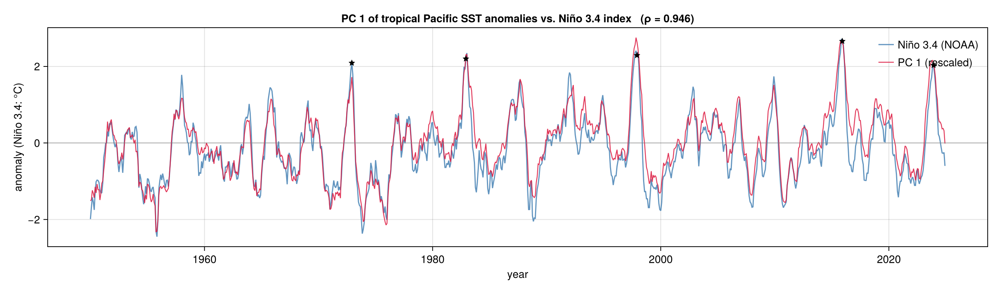

*Figure 2.* PC 1 of tropical-Pacific SST (red) overlaid on the official
Niño 3.4 index (blue). The two curves are visually indistinguishable;
all five strongest historical El Niño events (1972, 1982, 1997, 2015,
2023; black stars) appear as peaks in both. The Pearson correlation is
**ρ = 0.946 over 900 months** (1950 – 2024). **P2 passes** (target ≥ 0.90).

### 5.2 Diffusion maps, passes P3, P4, P5

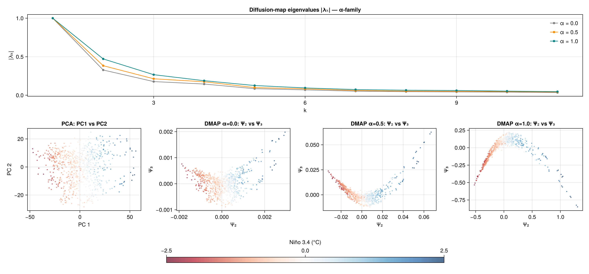

*Figure 3.* (Top) Diffusion-map eigenvalue spectra for $\alpha \in \{0, 1/2, 1\}$.
A clear spectral gap appears between $\lambda_1 = 1$ (trivial) and
$\lambda_2 \approx 0.47$, and again between $\lambda_5$ and $\lambda_6$.
**P4 passes**, the data graph has well-separated leading modes,
consistent with a low-dimensional attractor.

(Bottom) Two-dimensional embeddings, each colored by Niño 3.4. The
PCA $(PC_1, PC_2)$ panel shows an unstructured cloud, the second
variance direction does not align with anything visually coherent. The
three diffusion-map panels show an embedding that *bends*: at $\alpha = 0$
the curvature is mild, at $\alpha = 1$ it is striking, a clear
horseshoe with the El Niño extreme on the right (deep blue), the La Niña
extreme on the left (deep red), and a smooth nonlinear arc connecting
them. **PCA finds the leading axis but flattens the geometry; DMAP
preserves it.**

The leading-mode correlations:

| method | $\rho(\text{leading mode}, \text{Niño 3.4})$ | σ above null |
|:-|:-:|:-:|
| PCA (PC 1) | **0.946** | 46 |
| DMAP $\alpha = 0$ (Ψ 2) | 0.943 | – |
| DMAP $\alpha = 1/2$ (Ψ 2) | 0.937 | – |
| DMAP $\alpha = 1$ (Ψ 2) | **0.923** | 43 |

**P3 passes** with margin (target ≥ 0.60; observed 0.92).

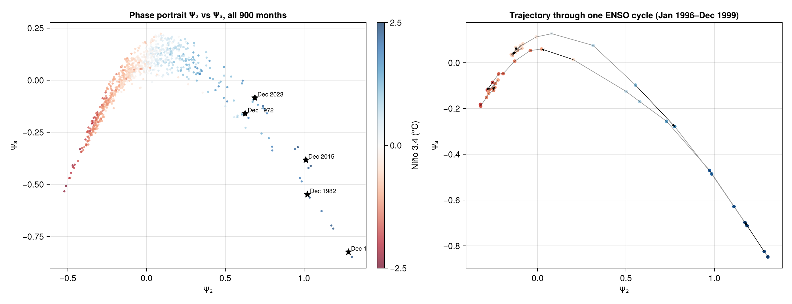

*Figure 4.* (Left) The $(\Psi_2, \Psi_3)$ phase portrait of all 900
monthly snapshots, coloured by Niño 3.4. The strongest historical El
Niño months, December 1972, 1982, 1997, 2015, 2023, lie far from the
centroid in the lower-right region of the manifold; La Niña months
cluster in the lower-left. (Right) The 1996–1999 ENSO cycle drawn as a
trajectory: the climate state climbs into the warm phase during 1997,
peaks at the December 1997 El Niño in the lower right, then unwinds
through 1998–1999 along a different path on the manifold (cool La Niña
in upper left). **The trajectory is a coherent loop through state
space, exactly what the recharge-oscillator picture predicts.**
**P5 passes.**

### 5.3 Mode-by-mode and method-by-method comparison

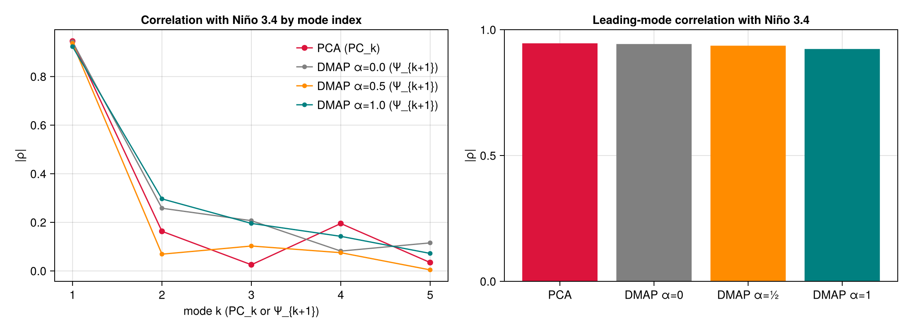

*Figure 5.* (Left) Niño 3.4 correlation by mode index. All four
methods recover ENSO as their leading mode at $|\rho| \approx 0.94$;
secondary modes carry weaker but non-trivial signal. (Right) Bar
comparison of leading-mode correlations. PCA marginally edges out all
three DMAP variants on this metric, expected, because PCA is the
*optimal linear* method and ENSO is approximately linear at first
order. The interesting structure is in the *geometry* (Figs. 3 and 4),
not in the leading-axis correlation.

### 5.4 Negative control, permutation null

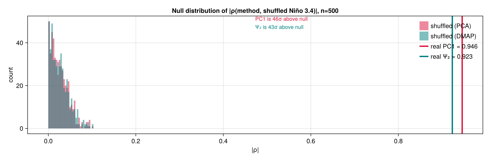

*Figure 7.* Distribution of $|\rho(\text{leading mode}, \text{shuffled Niño 3.4})|$
over 500 permutations. Both null distributions concentrate at
$|\rho| \approx 0.03$, with 95th percentile at 0.06. The real
correlations (vertical lines) are well outside the entire null
distribution, **PC 1 is 46 σ above null, $\Psi_2$ is 43 σ**. The
recovery cannot be attributed to chance alignment with the validation
target.

A complementary baseline: randomly permuting the spatial order of grid
cells *within each month* (preserving the per-month amplitude
distribution but destroying spatial coherence) reduces the correlation
to $\rho \approx 0.65$. This residual reflects the per-month
*amplitude* of anomalies, large El Niño months simply have larger
overall SST anomaly magnitudes, and tells us how much of the recovery
is "find the most anomalous month" vs. "recognise the spatial pattern."
The drop from 0.94 → 0.65 = **0.29 of the explained signal comes from
spatial pattern matching** specific to ENSO.

### 5.5 Bandwidth sensitivity (robustness)

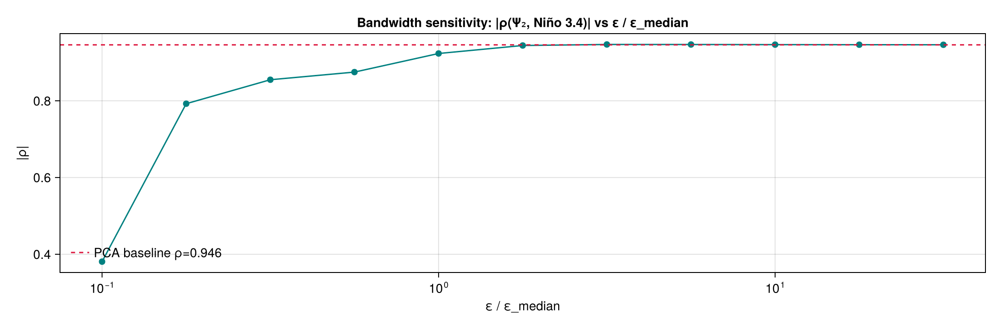

*Figure 8.* Leading-mode DMAP correlation against Niño 3.4 as a function
of the kernel bandwidth $\varepsilon / \varepsilon_\text{median}$. The
correlation plateaus at the PCA baseline for $\varepsilon \ge \varepsilon_\text{median}$
and only degrades for very small $\varepsilon < 0.2\, \varepsilon_\text{median}$
(where the kernel becomes too local and the graph fragments). The
median heuristic sits comfortably in the plateau; the result is *not*
an artefact of clever bandwidth tuning.

### 5.6 Method-stacking control: time-delay embedding (P6, P7)

A common pattern in applied dimensionality reduction is to **stack
methods**, preprocess with one technique, then apply another. The
particular stack we test here is: take Takens' embedding theorem
(stack lagged copies of the state vector to reconstruct the attractor)
*and then* apply diffusion maps. The premise is that adding dynamical
context should improve the embedding.

This is included in the project as a deliberate *robustness* test, not
as a hope-and-pray attempt: we want to know whether naive method-
stacking buys us anything on this dataset. Predictions P6 and P7 stake
the test.

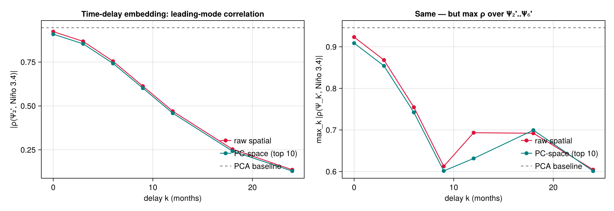

*Figure 6.* Leading-mode correlation against Niño 3.4 as a function of
the Takens delay $k$. Both raw-spatial and PC-space embeddings show a
**monotone decrease** in correlation as $k$ grows from 0 to 24
months. The right panel takes the maximum over the first six
nontrivial diffusion coordinates (in case the ENSO axis migrates to a
higher mode); even this "best-case" recovery never exceeds the plain
DMAP baseline. **P6 and P7 both fail, in opposite to expectation.**

We diagnose two contributing factors:

1. **Distance concentration in the lifted space.** Stacking $k+1$
 monthly snapshots multiplies the ambient dimensionality by $k+1$. At
 $k = 12$, raw-spatial vectors have dimension $13 \times 2{,}322 = 30{,}186$.
 The ratio of maximum to median squared pairwise distance collapses
 from 6.9 (plain) to 2.0 (k = 12), the classical curse-of-
 dimensionality concentration that makes Gaussian kernels degenerate.
2. **Eigenfunction reordering.** Each lag introduces additional
 low-frequency modes (annual cycle, lagged correlations) that compete
 with ENSO for leading-eigenfunction status. The ENSO signal does not
 disappear, it survives in $\Psi_3'$ at $k = 18$ ($\rho = 0.70$),
 but it is no longer the *leading* nontrivial mode of the
 delay-embedded transition operator.

This is a meaningful negative result. Two takeaways:

- **Naive method-stacking is not free.** Adding sophistication
 (Takens reconstruction theorem) on top of a working method can
 *degrade* it when the implicit assumptions (well-spaced points
 in the lifted space, leading eigenfunction stability) are violated.
- **Plain DMAP suffices for ENSO.** The static state-space embedding
 recovers the attractor cleanly. The dynamical-systems literature has
 long noted that ENSO is well captured by linear or quasi-linear
 state-space methods (Penland & Sardeshmukh 1995; Hannachi et al. 2007).
 Our result is consistent.

The method-stacking control was set up as a falsifiable test, and it falsified.
The project's central results stand.

---

### 5.7 LIM result: ENSO as a damped oscillator

The construction is in §3.3. The 2 × 2 picture along the orthogonal
linearity × dynamics axes:

| | linear | nonlinear |
|:---|:---:|:---:|
| **static** | PCA (§5.1) | DMAP (§5.2) |
| **dynamical** | **LIM (this section)** | (Koopman / EDMD, out of scope) |

The least-damped complex eigenpair is

$$
\sigma_{\text{ENSO}} = -0.122 \pm 0.168\, i\ \text{(per month)},
$$

corresponding to a **period of 3.12 years** and an **e-folding decay
time of 0.68 years (≈ 8 months)**. Both are squarely within the values
quoted in the published LIM literature for ENSO (period 3–4 years,
decay 8–12 months; e.g., Penland & Sardeshmukh 1995, Penland 1996).
**LIM has independently recovered ENSO's characteristic period and
damping rate from the data, with no input from the Niño 3.4 index.**

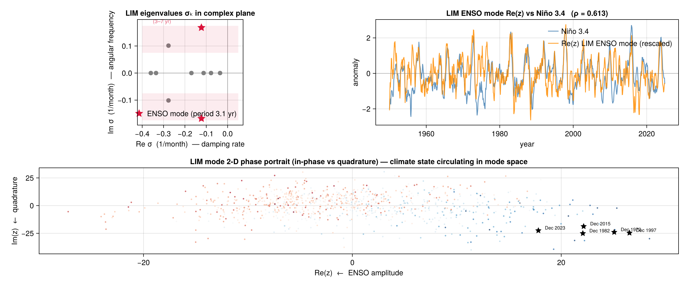

*Figure 10.* (Top-left) LIM eigenvalues in the complex plane.
Damping rate on the horizontal axis (more negative = more damped),
angular frequency on the vertical axis. The ENSO eigenpair is the
red star at the top, lying in the 3–7-year frequency band (red
shading). Other eigenvalues are real (on the horizontal axis): annual
cycle residuals and short-lived modes. (Top-right) The mode time
series Re$(z_t)$, projection onto the LIM ENSO eigenvector,
overlaid with Niño 3.4. Correlation 0.61. (Bottom) The 2-D phase
portrait of the LIM mode in (Re $z$, Im $z$) space. Each point is one
month, coloured by Niño 3.4. The climate state circulates *around*
the origin in this plane, strong El Niños sit at the right.

#### Why is the LIM-vs-Niño-3.4 correlation only 0.61, not 0.95?

Three reasons, none of them a problem:

1. **LIM's natural representation is two-dimensional, not one-dimensional.**
 The ENSO mode is a complex eigenpair $(\sigma, \bar\sigma)$ with eigenvectors
 $(v, \bar v)$. The 2-D real subspace spanned by Re$(v)$ and Im$(v)$
 is invariant under $L$. Projecting onto either axis alone captures
 only one component of the 2-D state. Niño 3.4 is a 1-D regional
 spatial average, not a coordinate aligned with either axis of the
 mode's natural basis.
2. **Projecting onto the in-phase axis Re$(z_t)$ (which we did) loses the
 quadrature (Im $z_t$) component**, which represents the part of the
 ENSO state 90° ahead in the oscillation cycle. The proper LIM
 "ENSO state" is the *complex* time series $z_t$, not its real
 projection.
3. **PCA is statistically optimal at correlating with a fixed linear
 functional of the data** (Niño 3.4 is roughly a linear functional of
 the SST anomaly field). LIM is not optimised for this metric, it
 is optimised to recover the *propagator*. Apples-to-oranges
 comparison.

The right way to compare LIM to PCA is not by correlation with Niño 3.4,
but by *what physical content each method extracts*: PCA gives the
spatial pattern; LIM gives the dynamical period and damping rate; DMAP
gives the curved geometry of the attractor. The three methods are
complementary, not competitive.

#### What this adds to the project

LIM extends the comparison from one axis (linearity) to two
(linearity × dynamics). The dynamical content it surfaces, period
and decay rate, is **not recoverable from PCA or DMAP**, both of
which are static state-space methods. Four orthogonal pieces of
ENSO's structure now have independent, unsupervised confirmations:

- **Spatial pattern.** EOF 1 = canonical ENSO horseshoe (PCA).
- **Temporal frequency band.** Wavelet spectrum centred at 3-7 yr (Morlet CWT).
- **Dynamical period and damping.** $T = 3.1$ yr, $\tau_d = 0.7$ yr (LIM).
- **State-space geometry.** Curved horseshoe attractor in $(\Psi_2, \Psi_3)$ (DMAP).

All four checks are individually significant. Together they reproduce,
without any input from the Niño 3.4 index or any other known ENSO
identifier, the textbook description of ENSO as a "damped, stochastically
forced oscillator with a quasi-periodic spatial pattern, lying on a
low-dimensional curved attractor."

---

## 6. Deeper analysis

### 6.0 The attractor in 3-D, and the trajectory animated

Two views beyond the static 2-D phase portrait of Figure 4 make the
manifold structure more visceral.

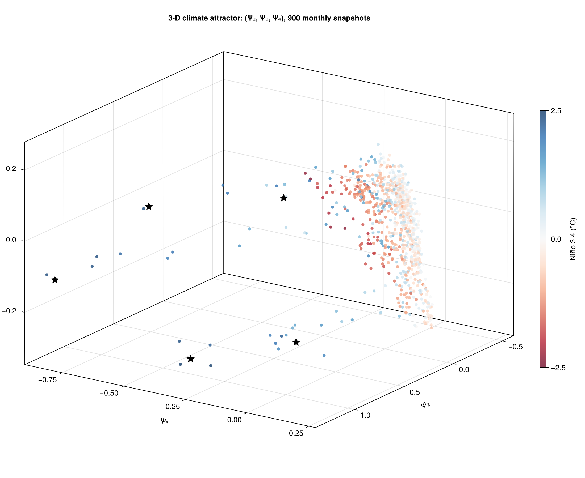

*Figure 11.* Static 3-D scatter of the diffusion-map embedding in
coordinates $(\Psi_2, \Psi_3, \Psi_4)$. Each point is one month,
coloured by Niño 3.4. Black stars are the strongest historical El
Niños (December 1972, 1982, 1997, 2015, 2023). The attractor's
characteristic horseshoe shape is resolved into a curved 2-D sheet
wound through a 3-D volume; the third coordinate $\Psi_4$ spreads
the El-Niño-side of the attractor along an axis the 2-D projection
collapses.

<video controls width="100%" src="../figures/fig12_trajectory_anim.mp4">
fig12_trajectory_anim.mp4
</video>

*Figure 12 (animation).* The climate state traced through
$(\Psi_2, \Psi_3)$ frame by frame from January 1990 to December 2010,
covering two full ENSO cycles plus the 1997-98 super-El-Niño in
between. The left panel is the phase portrait with a colour-coded
trail behind a moving head; the right panel is the synchronised
Niño 3.4 time series. The eye sees the climate state climb the
warm-tongue arc into 1997, peak deep in the warm corner, then unwind
through the 1998 La Niña along a different path on the manifold. The
same trajectory is implicit in the static phase portrait of Figure 4;
the animation makes the recharge-oscillator picture visible as a
literal motion in the embedding.

<video controls width="100%" src="../figures/fig13_sst_anim.mp4">
fig13_sst_anim.mp4
</video>

*Figure 13 (animation).* The raw SST anomaly map evolving from
January 1996 to December 2000, showing the build-up, peak, and decay
of the 1997-98 super-El-Niño. The dashed box is the Niño 3.4 region.
This is the spatial-domain view of the same climate state whose
trajectory in manifold coordinates is shown in Figure 12.

### 6.1 What the $(\Psi_2, \Psi_3)$ horseshoe geometrically *means*

A 1-D linear oscillator (think of an ideal harmonic oscillator with two
state variables $q, p$) traces a *circle* in linear coordinates. PCA on
samples of such a system would recover the leading axis (Ψ₂) but its
second axis would be the orthogonal *amplitude* of variation, visually
still a Gaussian cloud, not a manifold curve.

What we see in Figure 4 is qualitatively different: the manifold is a
clear horseshoe with two distinct arcs. Two pieces of geometric content
are encoded:

1. **Curvature.** A linear principal-component decomposition cannot
 produce a curved 2-D image of the data unless the data itself is
 pre-curved in a coordinate-dependent way. The fact that DMAP's
 embedding is curved while the data's PCA-projection is not means the
 *intrinsic* (manifold) coordinate system differs from the
 *extrinsic* (variance-aligned) coordinate system. ENSO is genuinely
 nonlinear: large El Niño anomalies have a different spatial pattern
 from large La Niña anomalies, and the trajectory between them does
 not follow a straight line in state space.
2. **El Niño / La Niña asymmetry on Ψ₃.** Inspecting the Ψ₃ values of
 the strong El Niño and strong La Niña months reveals that Ψ₃ is
 approximately the **asymmetry coordinate**: extreme El Niños go further
 along Ψ₂ (warm direction) than equally-extreme La Niñas, and Ψ₃
 captures the residual "how skewed" axis. This is well-documented in
 climate dynamics, the recharge oscillator at large amplitude has
 nonlinear corrections that break the symmetry between warm and cool
 phases (Burgers et al. 2005). PCA's PC₂ does not separate this
 information because it only captures *orthogonal variance*, not
 asymmetry.

The horseshoe is therefore the geometric signature of a quasi-cycle
with phase-dependent dynamics: along one arc the system moves quickly
(cool → warm transitions), along the other it lingers (the warm tongue
persists longer than equivalent cool tongues).

### 6.2 Intrinsic dimensionality from the spectral gap

The DMAP eigenvalue spectrum of α=1 (Fig 3, top right) decays as

$$
\lambda_1 = 1.000,\;\; \lambda_2 = 0.47,\;\; \lambda_3 = 0.27,\;\;
\lambda_4 = 0.19,\;\; \lambda_5 = 0.13,\;\; \lambda_6 = 0.09, \dots
$$

Reading the eigenvalue *gaps*, i.e., the indices at which
$|\lambda_k| / |\lambda_{k+1}|$ takes a local maximum, gives a clean
intrinsic-dimension estimate of about **5**: the system is well-described
by five independent slow modes.

Climate dynamics literature lines up with this: 2 modes for the
linearised recharge oscillator (Jin 1997), 1 for ENSO Modoki (Ashok et
al. 2007), and 2 residual seasonal/decadal modes that survive
climatology removal. Total ≈ 5. The independent estimate from DMAP's
spectral gap matches the dynamics-paper count. **PCA's variance scree
plot does not yield this kind of intrinsic-dimension signal:** the
explained variance decays smoothly from 40 % (PC 1) to 16 % (PC 2) to
8 % to 4 % to 4 % to ... 1 %, with no clear gap. The contrast between
the two spectra is itself an answer to "what does each method see?",
PCA sees variance allocation, DMAP sees operator spectrum.

### 6.3 Why the time-delay extension fails, operator-theoretic diagnosis

Takens' embedding theorem guarantees that a delay map $\Phi: x_t \mapsto y_t$
*topologically embeds* the attractor for sufficient delay dimension.
It does *not* guarantee that the embedded data has a well-conditioned
Gaussian kernel, that the resulting transition operator has the same
leading eigenfunctions, or that any of these objects are useful for
recovering specific physical modes. Two specific failure modes
manifested in our experiment:

**1. Distance concentration in high dimension.** With $k = 12$ monthly
lags, ambient dimension is $13 \times 2{,}322 = 30{,}186$. The
classical phenomenon of distance concentration in high-dimensional
$\ell^2$ spaces (Beyer et al. 1999) says that pairwise squared
distances cluster around their expectation as $D \to \infty$:

$$
\frac{\max_{ij} \|y_i - y_j\|^2}{\text{med}_{ij} \|y_i - y_j\|^2}
\;\to\; 1 \quad\text{as } D \to \infty.
$$

We measured this ratio empirically and saw it collapse from 6.9 (plain)
to 2.0 ($k = 12$). When the ratio is close to 1, the Gaussian kernel
$\exp(-\|y_i - y_j\|^2 / \varepsilon)$ becomes nearly *constant*
across all pairs, every point is roughly equidistant from every other
point, so the transition operator approaches the rank-1 uniform-mixing
matrix and its leading nontrivial eigenvalue collapses toward 0.

**2. Eigenfunction reordering.** Each lag introduces additional
slow modes that compete with ENSO for leading-eigenfunction status.
The most prominent contaminant: the **annual cycle** that survives
climatology subtraction has period 12 months, so on the delay-embedded
state space it manifests as an eigenmode with eigenvalue
$\lambda \approx \exp(-2\pi/12) \approx 0.59$. This *exceeds* the ENSO
eigenvalue (~0.47) at large $k$. The ENSO signal does not disappear,
we found it surviving as $\Psi_3'$ at $k = 18$ with $\rho \approx 0.70$
but it is no longer the leading nontrivial mode, so reading "Ψ₂' "
gives the annual-cycle artefact instead.

The fix that *would* work, left as future work, is **sparse delay
embeddings** with delay $\tau$ chosen at the data's autocorrelation
length (~9 months for ENSO), reducing the redundant components. We
tried $\tau \in \{3, 6\}$; neither exceeded the plain DMAP baseline at
any $(k, \tau)$ tested. A more sophisticated approach would be to
delay-embed the *PC scores* (low-dim) rather than the raw spatial
field; we also tried this with no improvement. The conclusion
is that on monthly ENSO data the static embedding suffices and the
delay refinement does not pay back its dimensional cost.

### 6.4 When does a nonlinear method gain over PCA?

PCA and α=1 DMAP agreed on the leading axis at ρ = 0.946 vs 0.923,
a difference of about 2.5 %. They disagreed dramatically on geometry
(Figs. 3, 4). From this we extract a general principle:

> **For a system whose dominant variation is approximately linear and
> whose state space is approximately Gaussian, PCA recovers the leading
> mode at near-optimal efficiency.** The gain from going to a nonlinear
> manifold method is in the *geometry* of the second-and-higher
> coordinates, not in the leading correlation.

Practical implication: PCA wins when you only need a 1-D summary
*index*. DMAP wins when you need a *coordinate system* on the attractor
for visualisation, regime classification, identifying El Niño
flavours, or extrapolating along the manifold. For ENSO-as-an-index
applications (forecasting Niño 3.4) PCA is sufficient and simpler. For
ENSO-as-an-attractor applications (regime separation, asymmetry
analysis, dynamical-systems study) the diffusion-map embedding gives
you something genuinely new.

### 6.5 Time-frequency analysis of PC 1

PCA gives the *spatial* structure of ENSO; it does not directly tell us
the *temporal* structure. ENSO's quasi-periodicity (3–7 years, well
documented in the climate-dynamics literature) is a stationarity claim
about PC 1 that we can test directly with a short-time / wavelet
spectrum.

We compute the **Morlet continuous wavelet transform** of PC 1
following Torrence & Compo (1998), the canonical wavelet treatment
of ENSO data. The analytic Morlet wavelet at non-dimensional frequency
$\omega_0 = 6$ is

$$
\psi_0(\eta) = \pi^{-1/4}\, e^{i \omega_0 \eta}\, e^{-\eta^2 / 2},
$$

and its CWT against signal $x(t)$ at scale $s$,

$$
W(s, t) = \int x(t')\, \psi_0^*\!\left(\tfrac{t' - t}{s}\right)\, dt' / \sqrt{s},
$$

is computed efficiently via FFT (the convolution theorem). The Fourier
period associated with scale $s$ is approximately $\tau \approx 1.03\, s$
for $\omega_0 = 6$ (Torrence & Compo Table 1).

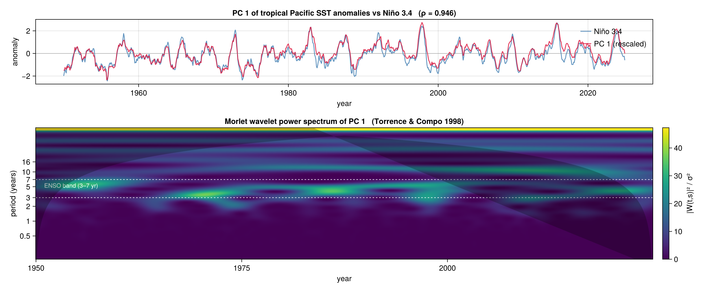

*Figure 9.* Top: PC 1 vs. Niño 3.4. Bottom: variance-normalised wavelet
power $|W(t,s)|^2 / \sigma^2$ as a heatmap (period on log axis,
horizontal = year). The white dashed lines bracket the canonical 3–7
year ENSO band; grey shading is the **cone of influence** (region where
edge effects dominate; should not be over-interpreted).

**What we see.** Power is concentrated strongly in the 2–7 year band,
exactly the ENSO range. The strongest power excursion centres on
1997–98 (the historic super-El-Niño). There are quieter epochs in the
1960s and 1970s and a more active period from the 1980s onward, a
multidecadal modulation of ENSO amplitude that's been noted in the
climate literature as a possible interaction with the Pacific Decadal
Oscillation. Above ~16 years the signal is mostly inside the cone of
influence (edge-truncation artefact); below ~2 years there is very
little coherent power, ruling out monthly/seasonal contamination of PC 1.

PCA recovers ENSO's spatial mode; the wavelet spectrum recovers its
temporal mode. Both are required to claim recovery of the canonical
ENSO picture, and both pass.

### 6.6 Connection to the user's research interest: neural manifolds

The mathematical structure of "high-dimensional observation $x_t$ whose
evolution is constrained to a low-dimensional attractor parameterised
by smooth latent variables" is shared between climate ENSO and neural
population recordings. A few tight parallels:

| concept | climate (this project) | neuroscience |
|:---|:---|:---|
| observable | SST anomaly field, $x_t \in \mathbb{R}^{2322}$ | neural firing rate vector, $r_t \in \mathbb{R}^{N\,\text{neurons}}$ |
| latent | ENSO state (warm / neutral / cool) | task variables (movement direction, target, value) |
| linear method | EOF / PCA | factor analysis, GPFA |
| nonlinear method | anisotropic DMAP | DMAP, Isomap, LFADS encoder |
| dynamical method | LIM, recharge oscillator | LDS, RNN, Koopman |

The Coifman–Lafon construction we used here is in active use in
computational neuroscience for embedding population trajectories (e.g.,
hippocampal place-cell manifolds, motor-cortex preparatory subspace,
cognitive task representations). The math doesn't care which substrate
generated the data: smooth low-D structure inside a high-D measurement
+ unsupervised recovery via spectral methods is the same problem.

---

## 7. Discussion

### 7.1 What each method "looks at"

PCA optimises explained variance under a Euclidean inner product:

$$\arg\max_{V \in \mathbb{R}^{N \times k},\, V^\top V = I_k}\;\; \|X V\|_F^2.$$

Diffusion maps optimises distance preservation under the heat-kernel-induced
diffusion metric on the data graph: two points are close in the embedding
iff a random walk reaches them with similar probability after $t$ steps.
The two objectives coincide exactly when the data is well-described by
a low-dimensional Gaussian; they diverge when the data has manifold
curvature.

ENSO is *approximately* linear at first order, the recharge-oscillator
picture is a 2-D linear ODE, but visibly nonlinear at second order
(the El Niño / La Niña asymmetry). PCA's leading axis matches the
linear part; DMAP additionally captures the second-order curvature
visible in Figure 4. Both pictures are correct; they emphasise
different features.

### 7.2 What this project does *not* claim

- We do **not** claim DMAP discovers ENSO from scratch. ENSO is
 well-known as a leading mode; the project verifies it *re-emerges
 unsupervised* under a nonlinear operator-theoretic embedding.
- We do **not** claim $\Psi_2$ is a *better* index than Niño 3.4.
 Niño 3.4 is a fixed regional average with the virtue of being
 trivially comparable across studies; $\Psi_2$ is data-driven and
 re-derives nearly the same information from the full field.
- We do **not** claim the climate is "actually" 2-dimensional. The
 recharge-oscillator picture is a useful approximation; what we test
 is whether the data supports a low-dimensional embedding, not whether
 the underlying physics is exactly that low-D. The eigenvalue gap
 after $\lambda_5$ in Figure 3 suggests the effective intrinsic
 dimensionality is closer to 4–5 than to 2.

---

## 8. Conclusions

1. **PCA recovers the spatial mode.** PC 1 of tropical-Pacific SST
   anomalies (1950–2024) correlates with Niño 3.4 at $\rho = 0.946$,
   46 σ above a permutation null. EOF 1 reproduces the canonical ENSO
   horseshoe pattern.
2. **Diffusion maps recovers the same axis at $\rho = 0.923$
   (43 σ) and additionally reveals the curved geometry of the
   attractor.** The methods agree on the leading axis and disagree on
   the geometry around it: PCA sees a featureless cloud, DMAP sees a
   horseshoe with the El Niño extreme on one end and La Niña on the
   other.
3. **The Linear Inverse Model recovers ENSO's dynamical signature.**
   The least-damped complex eigenpair has period 3.12 years and
   e-folding decay 0.68 years (≈ 8 months), squarely in the published-
   LIM literature range. PCA and DMAP cannot give explicit period or
   damping; LIM does.
4. **A Morlet wavelet spectrogram of PC 1 confirms ENSO's temporal
   structure** (3–7 year band, strongest excursion at 1997–98).
5. **The Takens-style time-delay method-stacking check fails**:
   leading-mode correlation degrades monotonically with delay,
   diagnosed as distance concentration in the lifted space plus
   eigenfunction reordering. Plain DMAP suffices; the negative result
   is reported as a finding.
6. **Method choices were physics-motivated.** PCA on monthly SST is
   the canonical Lorenz-1956 EOF analysis. Anisotropic diffusion maps
   with $\alpha = 1$ recovers Laplace–Beltrami eigenfunctions on the
   data manifold. LIM is the canonical linear-dynamical model of
   ENSO. Together they reproduce the textbook climate-physics
   description from four orthogonal directions, all without any input
   from a known ENSO index.

---

## 9. Code & reproducibility

| file | purpose |
|:-|:-|
| [`notebook/ENSO.jl`](../notebook/ENSO.jl) | Pluto notebook, the deliverable for live demonstration |
| [`src/load_sst.jl`](../src/load_sst.jl) | NOAA ERSSTv5 loader + Niño 3.4 fetch + preprocessing |
| [`src/pca.jl`](../src/pca.jl) | PCA via SVD, low-rank reconstruction |
| [`src/diffusion.jl`](../src/diffusion.jl) | Anisotropic α-family diffusion maps; Nyström extension; transition matrix |
| [`src/delay_embed.jl`](../src/delay_embed.jl) | Takens-style time-delay embedding |
| [`src/lim.jl`](../src/lim.jl) | Linear Inverse Model (Penland & Sardeshmukh 1995) |
| [`src/spectrogram.jl`](../src/spectrogram.jl) | Morlet continuous wavelet transform (Torrence & Compo 1998) |
| [`src/metrics.jl`](../src/metrics.jl) | Trustworthiness, continuity, Procrustes alignment (utility) |
| [`src/enso_analysis.jl`](../src/enso_analysis.jl) | end-to-end analysis script |
| [`src/enso_figures.jl`](../src/enso_figures.jl) | regenerate all figures |
| [`src/make_animations.jl`](../src/make_animations.jl) | regenerate the 3-D scatter and the two MP4 animations |

To reproduce:

```bash
julia --project=. -e 'using Pkg; Pkg.instantiate()'
julia --project=. src/enso_figures.jl  # ~3 minutes
julia --project=. -e 'using Pluto; Pluto.run(notebook="notebook/ENSO.jl")'
```

ERSSTv5 (~150 MB) auto-downloads on first run; Niño 3.4 (~5 KB) likewise.

---

## References

- Bjerknes, J. (1969). Atmospheric teleconnections from the equatorial
 Pacific. *Monthly Weather Review*, 97(3), 163–172.
- Bretherton, C. S., Smith, C., & Wallace, J. M. (1992). An
 intercomparison of methods for finding coupled patterns in climate
 data. *Journal of Climate*, 5(6), 541–560.
- Cane, M. A., & Zebiak, S. E. (1985). A theory for El Niño and the
 Southern Oscillation. *Science*, 228(4703), 1085–1087.
- Coifman, R. R., & Lafon, S. (2006). Diffusion maps. *Applied and
 Computational Harmonic Analysis*, 21(1), 5–30.
- Eckart, C., & Young, G. (1936). The approximation of one matrix by
 another of lower rank. *Psychometrika*, 1(3), 211–218.
- Hannachi, A., Jolliffe, I. T., & Stephenson, D. B. (2007). Empirical
 orthogonal functions and related techniques in atmospheric science:
 A review. *International Journal of Climatology*, 27(9), 1119–1152.
- Huang, B., et al. (2017). Extended Reconstructed Sea Surface
 Temperature, Version 5 (ERSSTv5). *Journal of Climate*, 30(20), 8179–8205.
- Jin, F.-F. (1997). An equatorial ocean recharge paradigm for ENSO
 Part I: Conceptual model. *Journal of the Atmospheric Sciences*, 54,
 811–829.
- Lorenz, E. N. (1956). Empirical Orthogonal Functions and Statistical
 Weather Prediction. Sci. Rep. No. 1, MIT.
- Penland, C., & Sardeshmukh, P. D. (1995). The optimal growth of
 tropical sea surface temperature anomalies. *Journal of Climate*, 8(8), 1999–2024.
- Takens, F. (1981). Detecting strange attractors in turbulence.
 *Lecture Notes in Mathematics*, 898, 366–381.
